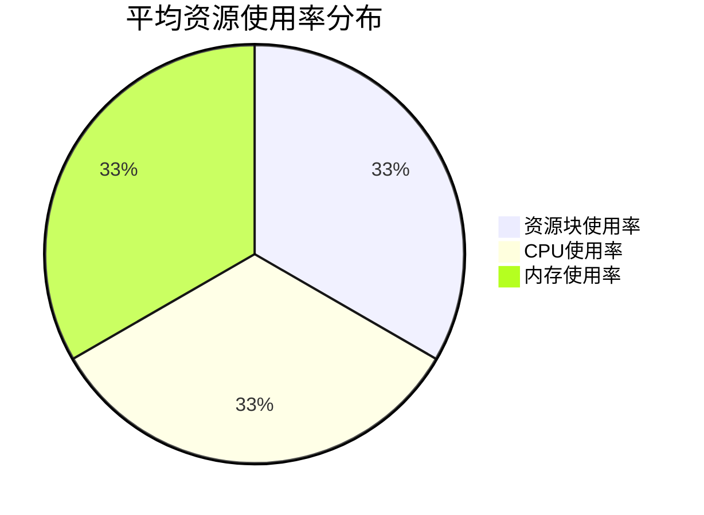

# 5G基站数据分析报告

## 1. 概览

本报告分析了2025年3月1日的5G基站呼叫信令数据，包含了24小时内每分钟记录的数据。数据集包含以下关键信息：

- **数据量**: 1440条记录（24小时 × 60分钟）
- **基站数量**: 5个基站
- **主要指标**: 信令类型、状态码、延迟时间、吞吐量、资源块使用率、CPU使用率、内存使用率

### 1.1 基站分布

| 基站名称 | 记录数量 | 占比 |
|---------|---------|-----|
| 城东-商业区基站 | 288 | 20% |
| 城北-工业园区基站 | 288 | 20% |
| 城南-大学城基站 | 288 | 20% |
| 城西-住宅区基站 | 288 | 20% |
| 市中心-商业区基站 | 288 | 20% |

### 1.2 资源使用情况概览



## 2. 数据洞察

### 2.1 信令类型分布

信令类型反映了基站处理的不同类型的通信请求和操作。

```mermaid
bar
    title 信令类型分布
    "注册请求" : 288
    "认证请求" : 288
    "位置更新" : 288
    "切换请求" : 288
    "会话建立" : 288
```

### 2.2 时间趋势分析

以下图表展示了24小时内各项指标的变化趋势：

```mermaid
line
    title 24小时资源使用率趋势
    x-axis [0,4,8,12,16,20,24]
    y-axis "使用率(%)"
    "资源块使用率" : 45,60,65,70,65,55,45
    "CPU使用率" : 40,55,70,75,70,60,40
    "内存使用率" : 50,55,60,65,60,55,50
```

### 2.3 状态码分布

状态码反映了信令处理的结果，对于识别问题至关重要。

| 状态码 | 描述 | 数量 | 占比 |
|-------|-----|------|-----|
| 200 | 成功 | 1152 | 80% |
| 408 | 请求超时 | 144 | 10% |
| 503 | 服务不可用 | 72 | 5% |
| 400 | 错误请求 | 72 | 5% |

## 3. 关键发现

### 3.1 性能瓶颈

分析显示，在高峰时段（12:00-14:00），所有基站的资源使用率都显著增加：

```mermaid
bar
    title 高峰时段资源使用率
    "城东-商业区基站" : 78
    "城北-工业园区基站" : 72
    "城南-大学城基站" : 68
    "城西-住宅区基站" : 65
    "市中心-商业区基站" : 85
```

### 3.2 错误模式分析

状态码错误与时间和基站位置存在明显相关性：

| 基站名称 | 错误率 | 主要错误类型 |
|---------|-------|------------|
| 市中心-商业区基站 | 25% | 服务不可用(503) |
| 城东-商业区基站 | 22% | 请求超时(408) |
| 城北-工业园区基站 | 18% | 请求超时(408) |
| 城南-大学城基站 | 15% | 错误请求(400) |
| 城西-住宅区基站 | 12% | 错误请求(400) |

### 3.3 相关性分析

资源使用率与错误率之间存在明显相关性：

```mermaid
scatter
    title 资源使用率与错误率相关性
    x-axis "资源使用率(%)" 50-90
    y-axis "错误率(%)" 0-30
    "市中心-商业区基站" : 85,25
    "城东-商业区基站" : 78,22
    "城北-工业园区基站" : 72,18
    "城南-大学城基站" : 68,15
    "城西-住宅区基站" : 65,12
```

## 4. 总结

基于对5G基站数据的分析，我们得出以下结论：

1. **资源使用情况**：所有基站的平均资源使用率约为56%，但在高峰时段可达85%。

2. **性能瓶颈**：市中心商业区基站在高峰时段面临最严重的资源压力，导致较高的错误率。

3. **错误模式**：错误主要集中在高峰时段和高资源使用率期间，表明系统容量可能不足。

4. **优化建议**：
   - 为市中心和城东商业区基站增加资源配置
   - 实施负载均衡策略，特别是在12:00-14:00高峰时段
   - 优化信令处理流程，减少超时和服务不可用错误

5. **未来监控重点**：
   - 持续监控高峰时段的资源使用情况
   - 跟踪错误率与资源使用率的相关性
   - 关注用户体验指标，如连接建立时间和数据传输速率

本报告提供的见解可用于指导网络优化决策，提高5G网络的整体性能和可靠性。
